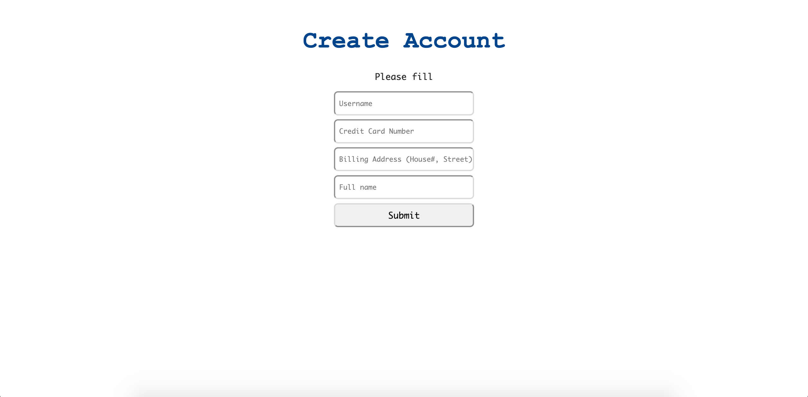
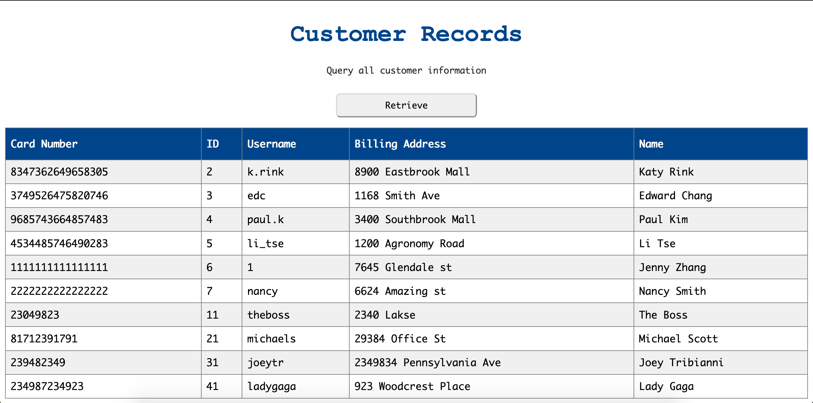
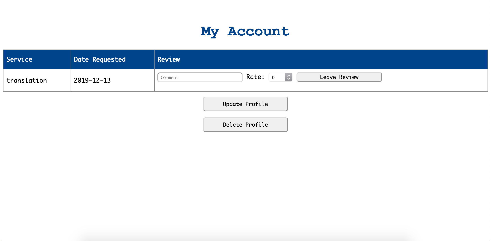
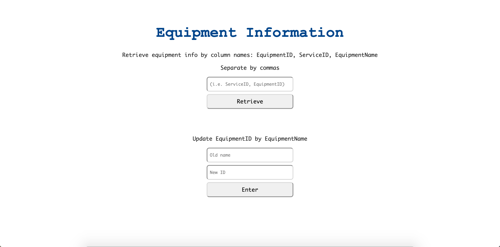
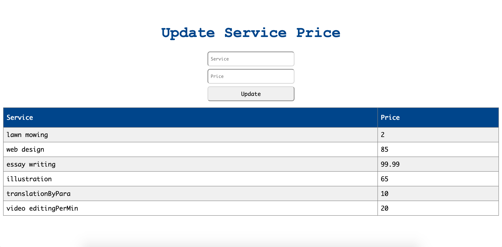
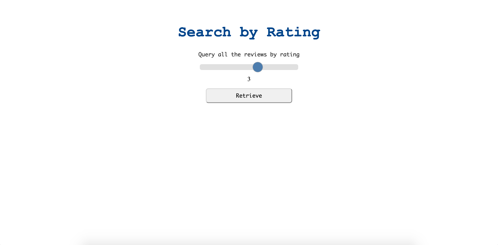

# Service Marketplace

Service Marketplace is a prototype application that allows users to purchase services sold by other users (i.e. video editing, essay writing, website development). A relational database is used to keep track of transactions and user information such as ratings, equipment information, and querying the database for all users. The user interface was developed with PHP, the database is implemented with MySQL, and the application was deployed with Heroku.

Open [https://mighty-hamlet-96281.herokuapp.com/](https://mighty-hamlet-96281.herokuapp.com/) to view it in the browser.

  

## Usage

The schema was conceptualized from scratch, and all relations have been normalized to **third normal form (3NF)**. 

Authentication, account settings, and account creation are functional, however, the main functionality of this application is in the administration page, which consists of a comprehensive set of queries that can be made on the relational database.

---

## Examples Admin Queries

| Database Function        |  SQL Query & Screen    |
| :-------------           |:-------------          | 
| Insert, Join |  | 
| Delete       |  | 
| Project      |        |   
| Update       |      |   
| Select       |   |

